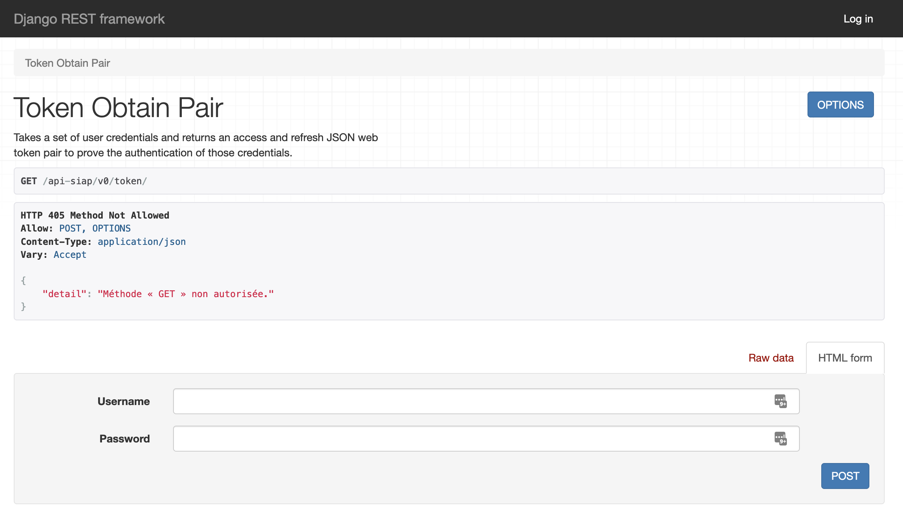
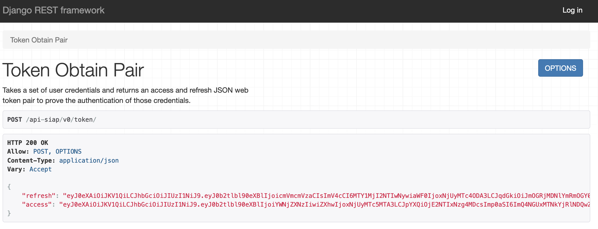
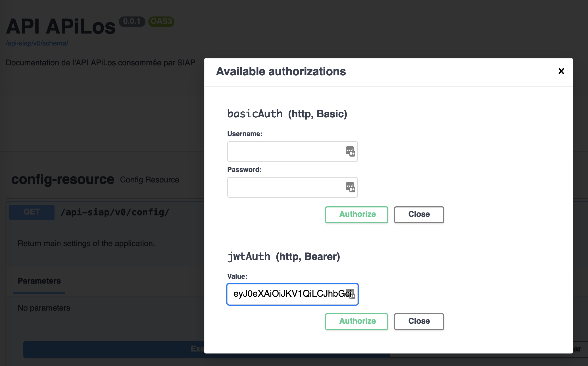

# API de la plateforme APiLos

## API pour le SIAP

Les API pour dialoguer avec le SIAP sont disponibles sur le endpoint `api-siap/vX`. \
X étant la version majeur de l'API SIAP

Une interface swagger est disponible sur la route `/api-siap/v0/schema-ui/` et le contrat d'interface OpenAPI 3 sur la route `/api-siap/v0/schema/`.

L'authentification se fait par JWT token avec le protocole HC256.

Pour se connecter, RDV sur la route `/api-siap/v0/token/`

Après connexion, récupérer l'access token

Accéder à l'interface swagger `/api-siap/v0/schema-ui/`, s'authentifier en copiant le token dans la partie jwt token

L'authentification dure 5 minutes...

## Les autres API

D'autres API sont disponibles sur le endpoint `api/vY`. \
Y étant la version majeur de l'API

On utilise une authentification Basic pour ces APIs. Les permissions des utilisateurs de l'API sont appliqué de la même manière que pour l'interface.
