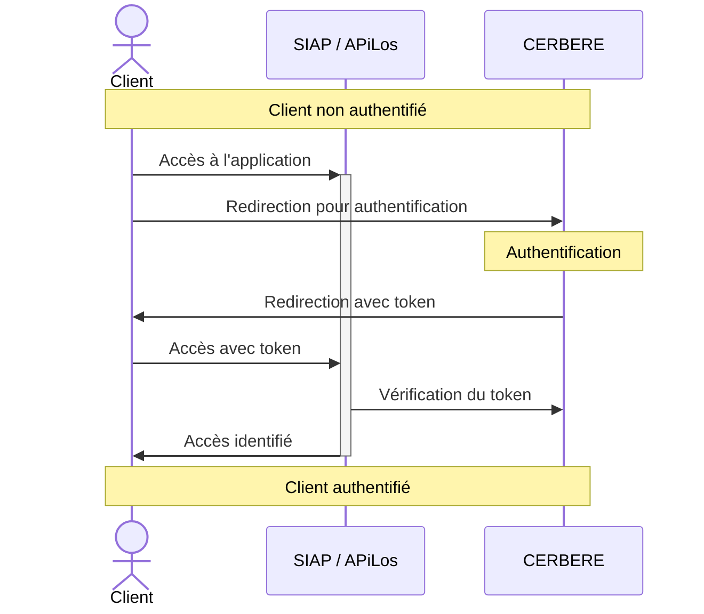
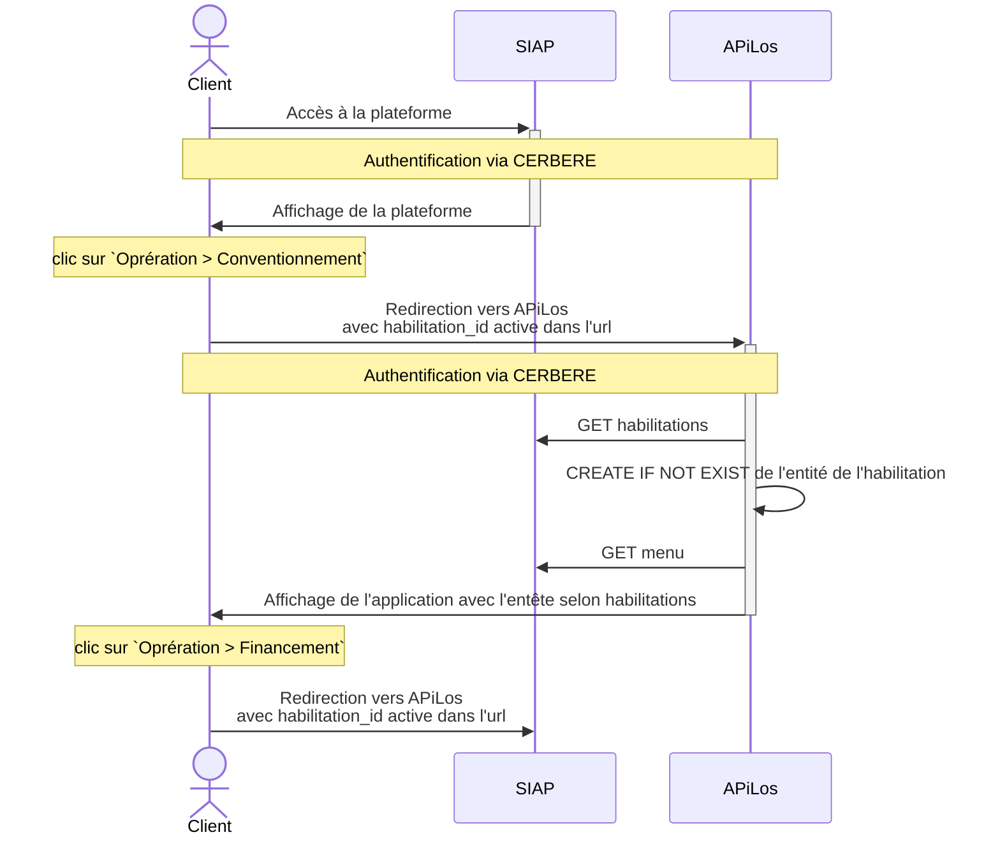
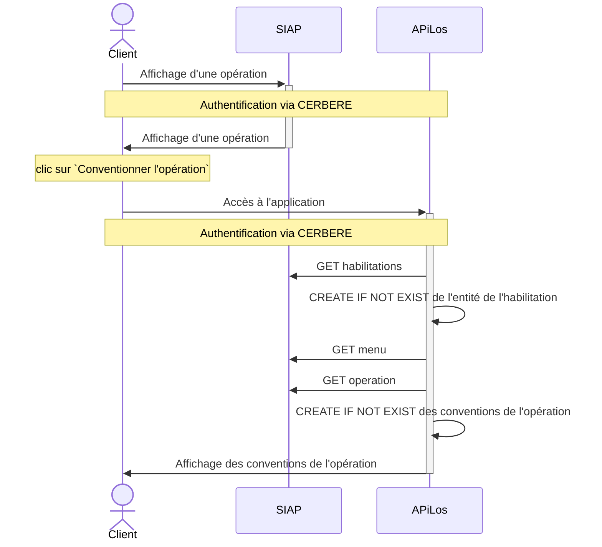
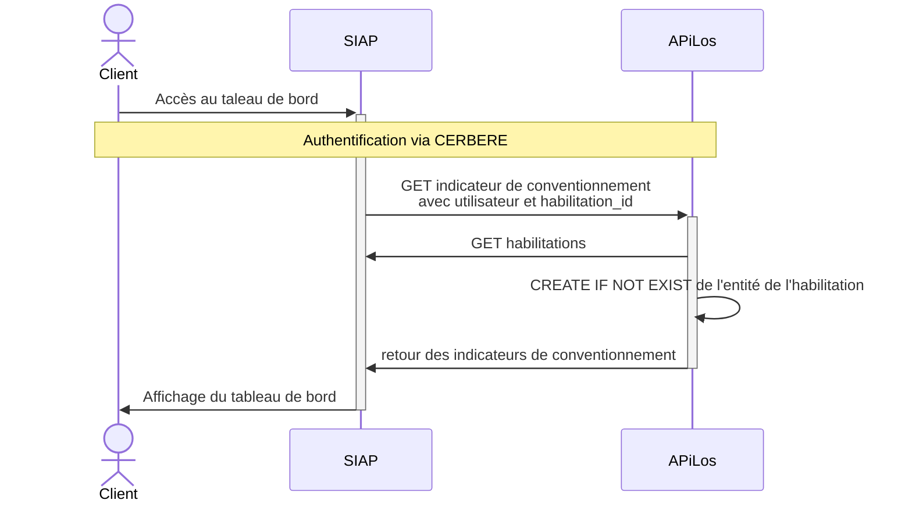

# Documentation des interactions SIAP APiLos

## Cas d'utilisation

### Autentification au SIAP ou APiLos via CERBERE

L'authentification via CERBERE utilise le même protocole pour SIAP et APiLos



Bloc nommé `Authentification via CERBERE` dans la suite du document

### Connexion au SIAP et redirection APiLos / SIAP via le menu




### Bascule vers le conventionnement à partir d'une opération SIAP




### Affichage des indicateurs de conventionnement dans le ableau de bord du SIAP




## Pour tester SIAP Client dans un shell :

Ouvrir un shell django

Puis test de quelques appels:

```python
>>> from siap.siap_client.client import SIAPClient
>>> SIAPClient.get_instance().get_habilitations(user_login='nicolas.oudard@beta.gouv.fr')
>>> SIAPClient.get_instance().get_menu(user_login='nicolas.oudard@beta.gouv.fr', habilitation_id=5)
>>> SIAPClient.get_instance().get_operation(user_login='nicolas.oudard@beta.gouv.fr', habilitation_id=27, operation_identifier='20221000003')
```

## Questions ouvertes pour plus tard :

- [ ] Comment retrouver les paramètres propres à APiLos dans la version SIAP
- [ ] Deloguer sur le SIAP / Apilos doit délogguer des 2 plateformes

## token exemple

```json
{
  "iat": 2655458148,
  "exp": 2655458448,
  "token_type": "access",
  "jti": "9f192912-426b-41c2-a8a5-ab51077a27fd",
  "user-login": "nicolas.oudard@beta.gouv.fr",
  "habilitation-id": 339
}
```
