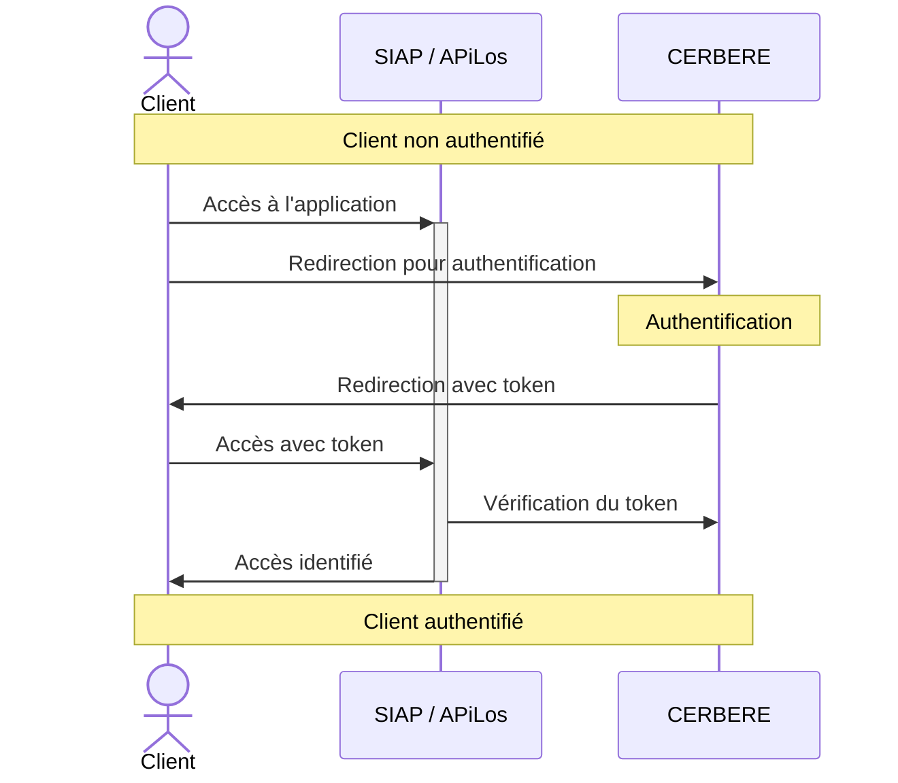
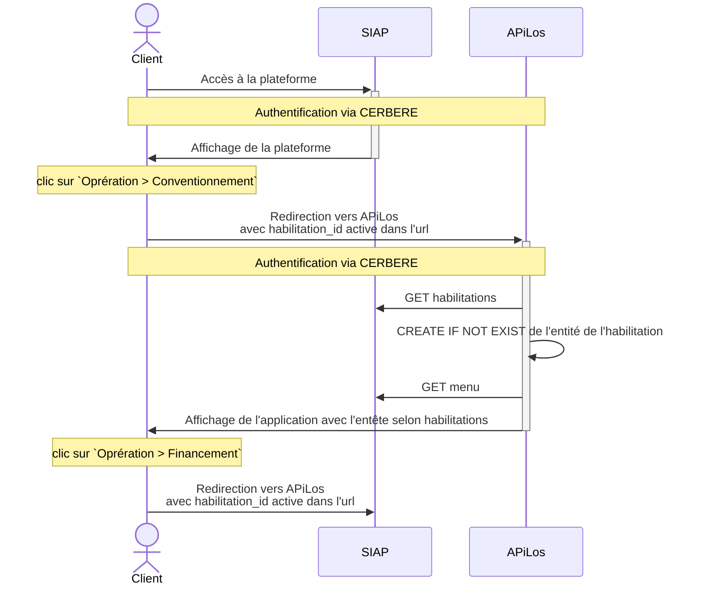
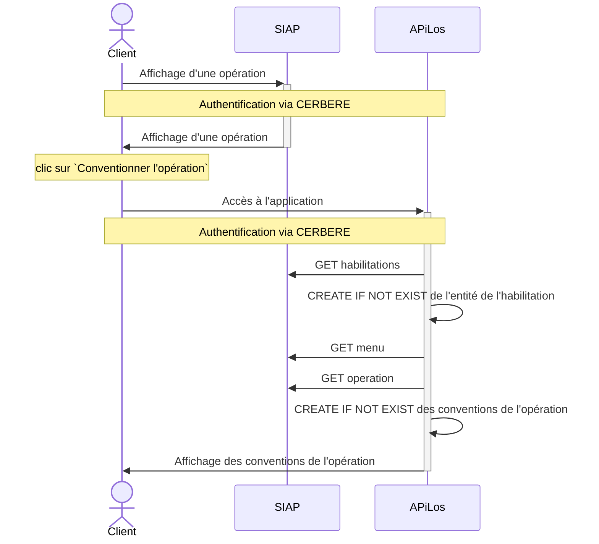
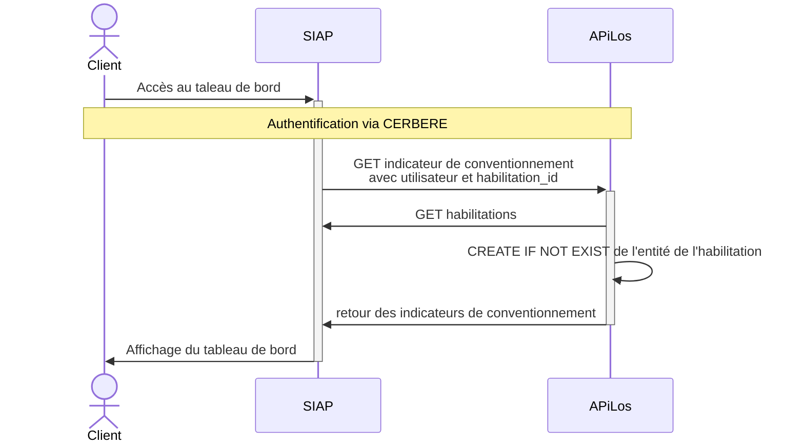

# Documentation des interactions SIAP APiLos

[Tableau de bord des développements communs entre SIAP et APiLos](https://airtable.com/shruWiCQNMkq6Wggk/tblNIOUJttSKoH866)

## Environnements

| Environnement  | URL SIAP          | URL APiLos version SIAP | URL APiLos autonome | Propos de l'environement |
| :--- | :--- |:--- |:--- |:--- |
| Production | https://siap.logement.gouv.fr (MTE) | https://apilos.logement.gouv.fr | https://apilos.beta.gouv.fr | Partagé avec la version APiLos autonome de production |
| Pilote | https://prehabilitation.siap.logement.gouv.fr (MTE) | ❌ | ❌ | Préhabilitation et recette de la reprise de donnée, pas d'intérêt d'avoir une plateforme APiLos en mirroir |
| Ecole | https://ecole.siap.logement.gouv.fr (MTE) | https://siap-ecole.apilos.beta.gouv.fr | ❌ | Utilisé pour les formations |
| Préproduction | https://preprod.siap.logement.gouv.fr (MTE) | ❌ | ❌ | Peu d'intérêt d'avoir un environnement mirroir APiLos puisse que ce cas est testé sur tous les autres environnements. Proposition : supprimer le lien avec la plateforme APiLos car l'environnement actuellement utilisé est déjà utilisé par la plateforme recette |
| Recette | https://minlog-siap.gateway.recette.sully-group.fr (Sully) | https://siap-recette.apilos.beta.gouv.fr | ❌ | Rectte métier |
| IntAPI | https://minlog-siap.gateway.intapi.recette.sully-group.fr (Sully) | https://siap-integration.apilos.beta.gouv.fr | https://staging.apilos.beta.gouv.fr | Utilisé pour le développement et la validation des fonctionnalités impliquant les 2 plateformes Partagé avec la version APiLos autonome de staging |

## Cas d'utilisation

### Autentification au SIAP ou APiLos via CERBERE

L'authentification via CERBERE utilise le même protocole pour SIAP et APiLos



Bloc nommé `Authentification via CERBERE` dans la suite du document

### Connexion au SIAP et redirection APiLos / SIAP via le menu




### Bascule vers le conventionnement à partir d'une opération SIAP




### Affichage des indicateurs de conventionnement dans le ableau de bord du SIAP



## Interprétation des Habilitations SIAP

Les habilitations sont interprétées de 3 manières :

1. Les Bailleurs

* Maitre d'ouvrage personne moral
* Maitre d'ouvrage personne physique

Les utilisateurs de type bailleur sont autoirisés à voir et modifier les opérations, conventions et objects associés appartenant à l'entité maitrise d'ouvrage définit par l'habilitation active.

2. Les instructeurs (Service gestionaire)

* Service gestionnaire

Les utilisateurs de type instructeur sont autoirisés à voir et modifier les opérations, conventions et objects associés appartenant à l'entité administrative définit par l'habilitation active.

3. Les administrateurs

* Service départemental
* Direction régionale
* Administration centrale

Les utilisateurs de type administrateur sont autoirisés à voir et modifier les opérations, conventions et objects associés selon la géographie du profile : le département, la région ou la france entièrte définit par l'habilitation active.

## Pour tester le Client de l'API du SIAP dans un shell (Appel de l'application SIAP à partir du backend de l'application APiLos)

Récupérer l'email de l'utilisteur utilisé pour les tests : généralement votre propre email utilisé pour se connecter à CERBERE
Récupérer l'ID de l'habilitation utilisé pour les tests : les ID sont accéssibles en inspectant les liens du menu permettant de changer d'habilitation en haut à droite de l'écran

Ouvrir un shell django, puis tester quelques appels:

```python
from siap.siap_client.client import SIAPClient
SIAPClient.get_instance().get_habilitations(user_login='user@domain.com')
SIAPClient.get_instance().get_menu(user_login='user@domain.com', habilitation_id=5)
SIAPClient.get_instance().get_operation(user_login='user@domain.com', habilitation_id=27, operation_identifier='20221000003')
```

## Pour tester le Client de l'API d'APiLos dans un shell (Appel de l'application APiLos à partir du backend de l'application SIAP)

Récupérer l'email de l'utilisteur utilisé pour les tests : généralement votre propre email utilisé pour se connecter à CERBERE
Récupérer l'ID de l'habilitation utilisé pour les tests : les ID sont accéssibles en inspectant les liens du menu permettant de changer d'habilitation en haut à droite de l'écran

Ouvrir un shell django, pour générer un Token JWT :

```python
from siap.siap_client.client import build_jwt
build_jwt(user_login="nicolas.oudard@beta.gouv.fr", habilitation_id=31)
```

Accéder à l'interface de test : <HOST>/api-siap/v0/schema-ui/#/statistics/convention_kpi_list

Cliquez sur le bouton `Authorize` à droite de d'écran et copier le JWT token

L'ensemble des fonctions de la page sont maintenant testables

⚠️ Attention, le token JWT n'est valide que 5 minutes

### Exemple du contenu du token JWT généré par la fonction build_jwt

```json
{
  "iat": 1555458148,
  "exp": 2655458448,
  "token_type": "access",
  "jti": "c14f318c99024a398a39281d3827e612",
  "user-login": "user@domain.com",
  "habilitation-id": 6
}
```

Il est possible aussi de générer de token via un site tel que https://jwt.io/ et en utilisant la clé JWT_SIGN_KEY pour signer le token

## Questions ouvertes pour plus tard :

- [ ] Comment retrouver les paramètres propres à APiLos dans la version SIAP
- [ ] Deloguer sur le SIAP / Apilos doit délogguer des 2 plateformes

