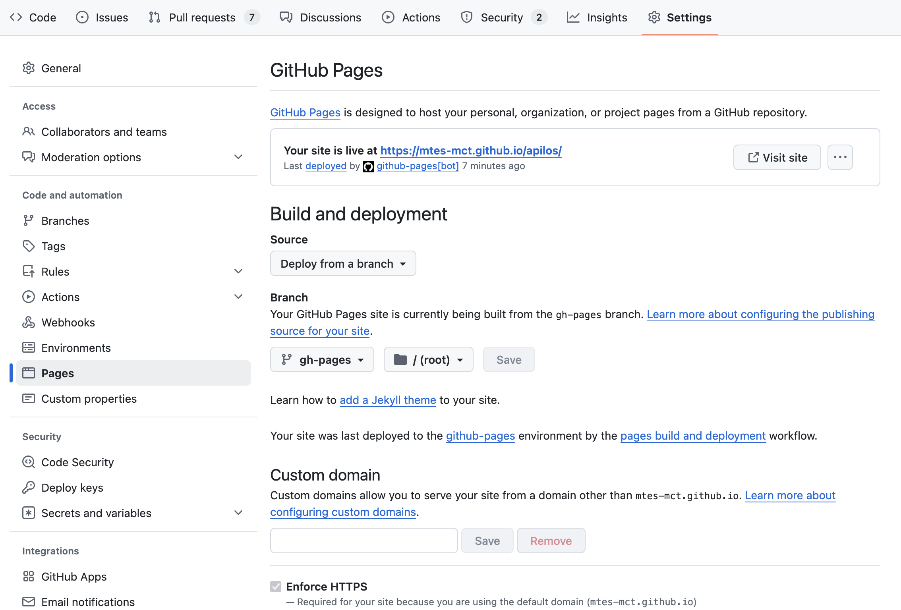

```{toctree}
```

# DEPLOIEMENT DE LA PLATEFORME APILOS

## Solution d'hébergement

La solution souveraine PaaS de [Scalingo](https://dashboard.scalingo.com/apps/osc-fr1/fabnum-apilos) est utilisée avec les composants suivants :

* webapp : Application Django incluant interface et APIs, la webapp est déployé un système Ubunti 20.x
* worker : worker Celery pour déléguer des tâches longues qui s'executeront de manière asynchrone
* Une base de données postgres en version 12.11.0
* Une base de données Redis utilisé comme «message queue» pour passer les instructions au worker

Les applications lancées sont configurées dans le fichier [Procfile](https://github.com/MTES-MCT/apilos/tree/main/Procfile)

La base de données est sauvegardée toutes les nuits et Scalingo propose une solution PITR (Point-in-time recovery) pour sa restauration.

## CI/CD et branch git

Les "User Stories" (US) sont développées sur des "feature branches" (convention de nommage sNUM-US_DESCRIPTION) à partir de la branch `main`.
les `feature branches` font l'objet de `pull request` à merger sur `main`.

La solution github actions est utilisée: [Github Actions](https://github.com/MTES-MCT/apilos/actions)
La config est ici : [.github/workflows](https://github.com/MTES-MCT/apilos/tree/main/.github/workflows)

### Comment release

- Taggez le dernier commit de la branche main et uploadez sur github.

`git tag v1.23.0`
`git push --tags`

La CI va lancer les tests, déployer en production et créer une release.

- Vérifiez que les déploiements en production se passent bien en consultant les logs. Une CI verte ne veut pas dire que le déploiement a fonctionné.

- Ajoutez le changelog technique à la release github, vous pouvez le générer avec la commande

`git log v1.23.0...v1.22.0 --oneline`

- Toujours sur la release github, ajoutez les sections Fonctionnalités, Correctifs, Mise à jour des dépendances et Amélioratons techniques. Ajoutez-y les lignes de changelog qui correspondent en reformulant pour les rendre compréhensible par quelqu'un de non-technique. Inspirez-vous des releases précédentes.

- Prévenez de la mise en production sur mattermost, ainsi que sur le slack du SIAP.

- Sur le board de sprint, passez les tickets de staging vers prod.

### CI

A chaque push sur [Github](https://github.com/MTES-MCT/apilos), le projet est compilé et les tests sont passés

### CD

A chaque push sur la branche `main`, le projet est déployé en [staging](https://siap-integration.apilos.beta.gouv.fr/).

A chaque push de tag de la forme `v*.*.*`, le projet est déployé en production.

## Déploiement

Lors du déploiement, les étapes définis dans le script [bin/post_deploy](https://github.com/MTES-MCT/apilos/tree/main/bin/post_deploy) sont exécutées :

1. Execution des migrations de la base de données
2. Population des roles et des permissions
3. Suppression des sessions expirées

### Déploiement en staging

Le code est déployé en staging automatiquement via Github Actions quand il est poussé sur la branch `main` du repository [Github](https://github.com/MTES-MCT/apilos)

Pour forcer le déploiement en staging, il est aussi possible de pousser la branche main sur le repo git du projet sur Scalingo

```git push git@ssh.osc-fr1.scalingo.com:apilos-staging.git main:master```

### Déploiement en production

Une nouvelle version de l'application est poussée en production à chaque ajout de _tag de version_ (voir [la documentation _semantic versioning_](https://semver.org/)).

Pour forcer la mise en production il est aussi possible de pousser la branche `main` sur le repo git du projet sur Scalingo :

```bash
git push git@ssh.osc-fr1.scalingo.com:fabnum-apilos.git main:master
```

## Déployer un nouvel environnement

1. ajout d'une application dans scalingo
1. Ajout d'addons : postgresql, redis
1. Ajout des variable d'environnement (Scalingo > Environnement)
1. Ajout du nom de domaine dans scalingo (Scalingo > Settings > Domain/SSL)
1. Ajout d'un enregistrement DNS CNAME vers l'APP Scalingo (Alwaysdata > Domains > DNS Records)
1. Forcer HTTPS (Scalingo > Settings > Routing)
1. Scale les APPs (Scalingo > Resources)
1. Créer le bucket sur scaleway

Pour le SIAP,

9. Créer un utilisateur SIAP et transmettre son id à l'équipe du SIAP

## Executer une commande python sur un Scalingo

Il suffit d'ajouter avant `python manage.py` le début de commande :

```bash
scalingo --app <app_name> run ...
```

## Modification de l'appartenance d'un programme à un bailleur ou une administration

### Modification de l'administration

Récupérer au préalable les informations suivantes:
* UUID du programme
* Code de l'administration (cf. admin django)

```
$> python manage.py programme_update_administration
Quel est l'identifiant UUID du programme à modifier ? 4fa6ec1c-b89c-4a8e-ba2c-da18ad1bd194
le programme `4fa6ec1c-b89c-4a8e-ba2c-da18ad1bd194` : `Opération L9TQKLS6EC` va être modifié
Quel est le code de l'administration à laquelle le programme doit être rattacher ? 13055
le programme `Opération L9TQKLS6EC` va être attribué à l'administration `Métropole d'Aix-Marseille-Provence` de code `13055`
Modifier l'administration du programme (Non/oui)?oui
l'administration du programme `Opération L9TQKLS6EC` a été mise à jour avec l'administration de code `13055`
le programme `Opération L9TQKLS6EC` va être attribué à l'administration `Métropole d'Aix-Marseille-Provence` de code `13055`
```

### Modification du bailleur

Récupérer au préalable les informations suivantes:
* UUID du programme
* Numero siret du bailleur (cf. admin django)

```
$> python manage.py programme_update_bailleur
Quel est l'identifiant UUID du programme à modifier ? 4fa6ec1c-b89c-4a8e-ba2c-da18ad1bd194
le programme `4fa6ec1c-b89c-4a8e-ba2c-da18ad1bd194` : `Opération L9TQKLS6EC` va être modifié
Quel est le siret du bailleur auquel le programme doit etre rattacher ? 48496369900026
le programme `Opération L9TQKLS6EC` va être attribué au bailleur `6ème Sens Immobilier Investissement` de siret `48496369900026`
Modifier le bailleur du programme (Non/oui)?oui
le bailleur du programme `Opération L9TQKLS6EC` a été mise à jour avec le bailleur de siret `48496369900026`
```

## Remise à zéro des éléments métiers de la base de données d'un environnement

```
$> python manage.py clear_all_data
```

Les bailleurs, administrations et tous les objets leur appartenant seront supprimé (programmes, lots, conventions, logements, annexes, type_stationnements... etc)
ainsi que les utilisateurs qui sont ni `superuser` ni `staff`

⚠️ Cette commande n'est pas executable en production pour des raisons évidentes

## Rechargement des fixtures de tests en staging

Il est possible de déployer un jeu de donnée de tests en utilisant la commande `load_test_fixtures`

```
$> python manage.py load_test_fixtures
Do you want to truncate Conventions/Operations/Lots (N/y) ?
Using default option: Operation won't be truncated
Do you want to truncate Users (N/y) ?
Using default option: Users won't be truncated
```

⚠️ Cette commande n'est pas executable en production car il n'est pas souhaitable de mélanger données de test et production

## Chargement d'un jeu de test

Un jeu de données minimales est disponible dans le fichier dataset_staging.json. Il se déploie en utilisant la commande `loaddata dataset_staging.json`
⚠️ Cette commande ne doit pas être exécutée en production car il n'est pas souhaitable de mélanger données de test et production

## Déploiement de Metabase

Suivre les instructions de la doc de l'incubateur :

https://doc.incubateur.net/communaute/travailler-a-beta-gouv/jutilise-les-outils-de-la-communaute/metabase

Pour mettre à jour

```
scalingo --app apilos-metabase-prod deploy https://github.com/Scalingo/metabase-scalingo/archive/refs/heads/master.tar.gz
```

Quelques informations complémentaires:
* Metabase est installé sur le projet `apilos-metabase-prod` sur scalingo
* L'installation de Metabase nécessite une base de données accessible en écriture. Nous avons doc fait le choix de créer une DB dédié à Métabase comme addon du projet `apilos-metabase-prod` sur scalingo, celle-ci sert à l'administration de Metabase, les infomations de connection à la base de données sont accessible sur scalingo e interprétant la variable d'environnement SCALINGO_POSTGRESQL_URL
* La base de données APiLos est configurée dans l'administration de Metabase et a un accès en Lecture seule
* Les données stockées par Metabase sont cryptées grâce à la variable d'environnement MB_ENCRYPTION_SECRET_KEY

Metabase est accessible à l'adresse [https://apilos-metabase-prod.osc-fr1.scalingo.io/](https://apilos-metabase-prod.osc-fr1.scalingo.io/)

## Deploiement de la documentation technique

Les librairies nécessaires à la génération de la documentation sont maintenus dans le document [doc-requirements.txt](https://github.com/MTES-MCT/apilos/tree/main/doc-requirements.txt), généré avec pip-tools depuis [doc-requirements.in](https://github.com/MTES-MCT/apilos/tree/main/doc-requirements.in)

La publication est executé à chaque mise à jour de la branch main via l'action github [publish-docs.yml](https://github.com/MTES-MCT/apilos/tree/main/.github/workflows/publish-docs.yml)

La configuration Github suivante est nécessaire :




## Configuration d’une clé SSH pour Scalingo et GitHub

Les clés SSH permettent d'établir une connexion sécurisée entre le runner du pipeline CI et l'environnement PaaS Scalingo.
Elles sont indispensables pour :
- authentifier les accès à Scalingo depuis GitHub.
- permettre à la CI de pousser du code automatiquement sur Scalingo.
- exécuter des commandes à distance sur l'environnement Scalingo.
- déployer l'application sur le PaaS Scalingo de manière sécurisée.


### 1. Générer une clé SSH avec l’algorithme **ed25519**

```bash
ssh-keygen -t ed25519
```

### 2. Lancer l’agent SSH

```bash
eval "$(ssh-agent -s)"
```

### 3. Ajouter la clé privée à l’agent SSH

```bash
ssh-add ~/.ssh/id_ed25519_scalingo
```

### 4. Vérifier que la clé est bien chargée

```bash
ssh-add -l
```


### 5. Ajouter la clé publique à Scalingo

1. Aller dans **User settings > SSH keys > Add**.
2. Copier le contenu de la clé publique générée (`~/.ssh/id_ed25519_example.pub`) et la coller dans le champ prévu.
3. Donner un nom explicite, par exemple : `nom-pc-id_ed25519_scalingo`.
4. Sauvegarder.

### 6. Vérifier l’accès à Scalingo depuis votre PC

```bash
ssh -T git@ssh.osc-fr1.scalingo.com
# ou
ssh -T git@ssh.osc-secnum-fr1.scalingo.com
```

Si tout est correct, vous verrez le message :
**“You’ve successfully authenticated on Scalingo, but there is no shell access.”**


### 7. Ajouter la clé privée dans GitHub (projet Apilos)

1. Dans GitHub, ouvrir **Settings > Secrets and variables > Actions**.
2. Ajouter ou modifier le secret : `SCALINGO_SSH_PRIVATE_KEY`.
3. Coller le contenu de la clé **privée** (`~/.ssh/id_ed25519_example`).
4. Sauvegarder.
